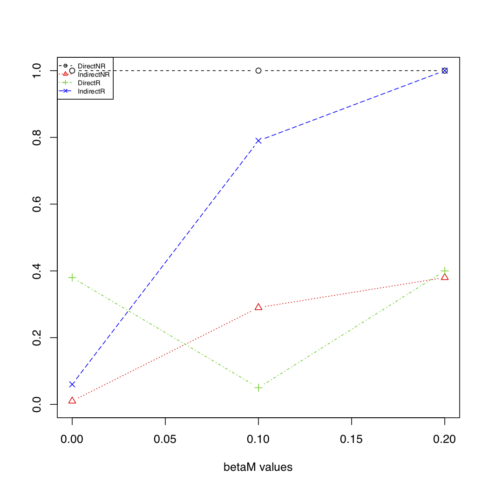

## Extension of reverseMA with Threading
These functions examines the performance of mediation analysis methods in the presence of reverse causality.

## Installation
Requirements:
* R v3.4 or higher
* You will need the proper compiling tools for your platform.
  * For Windows (Rtools installer): https://cran.r-project.org/bin/windows/Rtools/
  * For MacOSX (clang and gfortran): https://cran.r-project.org/bin/macosx/tools/

```
install.packages("devtools") # devtools must be installed first

# these may fail to install or update/upgrade when already loaded, and install_github will sometimes 
# load these as part of its activity, and will then try to install them if they need 
# an update for one of the package dependencies
install.packages(c("Rcpp","RcppEigen", "curl"), quiet=T) 

devtools::install_github("SharonLutz/reverseMAthread",quiet=T)
```
The install process will involve compiling source code. If you are on MacOSX, this may involve the clang compiler issuing warnings about unknown pragmas similar to the text below. Do not be alarmed if you see these. If there is actually an error, it will be present among the last several messages issued by the compiler.
```
warning: pragma diagnostic pop could not pop, no matching push [-Wunknown-pragmas]
```

## Example:
```
library(reverseMAthread)
?reverseMAthread # For details on this function

reverseMAthread(n = 1000, pX = 0.2, gamma0 = 0, gammaX = 0.2, varM = 1, beta0 = 0, betaX = 0, 
betaM = c(0.1, 0.2, 0.3), varY = 1, nSim = 100, nSimImai = 100, SEED = 1, plot.pdf = T, 
plot.name = "reverseMAplotIndirect.pdf", alpha_level = 0.05)

 reverseMAthread(n = 1000, pX = 0.2, gamma0 = 0, gammaX = 0, varM = 1, beta0 = 0, betaX = 0.2, 
betaM = c(0.1, 0.2, 0.3), varY = 1, nSim = 100, nSimImai = 100, SEED = 1, plot.pdf = T, 
plot.name = "reverseMAplotDirect.pdf", alpha_level = 0.05)

 reverseMAthread(n = 1000, pX = 0.2, gamma0 = 0, gammaX = 0.2, varM = 1, beta0 = 0, betaX = 0.2, 
betaM = c(0.1, 0.2, 0.3), varY = 1, nSim = 100, nSimImai = 100, SEED = 1, plot.pdf = T, 
plot.name = "reverseMAplotBoth.pdf", alpha_level = 0.05)
```

## Speeding things up with optional parameters:
### MultiProcessing And/Or Use of Threading and Eigen via C++
the reverseMAthread command accepts the following parameters:
* use_multi_processing, a boolean (T, F, True, or False), which turns on the multi-processing feature
* use_cpp, a boolean(T, F, True, or False), which activates the use of Rcpp RcppEigen, and threading if multiprocessing is not turned on as well.
* num_jobs, an integer specifying the number of processes or threads you wish to use.
```
#Example Using Rcpp with Eigen and 5 threads:

reverseMAthread(n = 1000, pX = 0.2, gamma0 = 0, gammaX = 0.2, varM = 1, beta0 = 0, betaX = 0.2, 
betaM = c(0.1, 0.2, 0.3), varY = 1, nSim = 100, nSimImai = 100, SEED = 1, plot.pdf = T, 
plot.name = "reverseMAplot.pdf", alpha_level = 0.05, use_cpp=T, num_jobs=5)


#Example Using MultiProcessing and vanilla R (without using Rcpp with Eigen) with 7 subprocesses:

reverseMAthread(n = 1000, pX = 0.2, gamma0 = 0, gammaX = 0.2, varM = 1, beta0 = 0, betaX = 0.2, 
betaM = c(0.1, 0.2, 0.3), varY = 1, nSim = 100, nSimImai = 100, SEED = 1, plot.pdf = T, 
plot.name = "reverseMAplot.pdf", alpha_level = 0.05, use_multi_processing=T, num_jobs=5)


#Example Using MultiProcessing and Rcpp with Eigen with 4 subprocesses (1 thread each):

reverseMAthread(n = 1000, pX = 0.2, gamma0 = 0, gammaX = 0.2, varM = 1, beta0 = 0, betaX = 0.2, 
betaM = c(0.1, 0.2, 0.3), varY = 1, nSim = 100, nSimImai = 100, SEED = 1, plot.pdf = T, 
plot.name = "reverseMAplot.pdf", alpha_level = 0.05, use_cpp=T, use_multi_processing=T, num_jobs=4)
```

### Important Considerations for the Faster Processing Strategies:

#### Determining Number of Cores and amount of RAM available on your system:
For Windows:
Opening the start menu and searching for System Information, or running %windir%\system32\msinfo32.exe at the command prompt should open a window giving a system summary. The Row beginning with "Processor" will list your CPU's name and describe the number of physical and logical cores. For our purposes, the number of logical cores is the value for consideration.

Additionally, the rows containing the entries "Total Physical Memory" and "Available Physical Memory" will help you when determining how many processes you can run safely in multiprocessing mode. You can also benefit from the use of Task Manager. Ctrl-Alt-Esc or Ctrl-Alt-Del can be used to bring up Task manager depending on your version of Windows. 

For Mac OSX:

From a terminal: 
```
sysctl hw.physicalcpu hw.logicalcpu #should show the number of physical and logical cores.

sysctl hw.memsize #displays the total available memory.
```

the 'top' command can serve a similar functionality to the task manager in windows. It will monitor executing processes in real time and give you readouts on how much each process is consuming.


For linux:
There is a system file '/proc/cpuinfo' which contains information about the processors available on the system. There should be one entry per logical core.

There is also a system file for memory '/proc/meminfo' as well as commands like 'free' which can help you to figure out how much RAM is available.

The 'top' command is also typically available on linux.

#### What to do with this information?

It is advisable in a standard use case that you tailor your num_jobs variable to be the # of your logical CPU cores - 1, at the maximum, to leave 1 core free to handle the original calling R process and any background OS processes. If you use more procesess or threads than this, your system may become slow and relatively unresponsive and may lock up until the processing completes, and it will likely not benefit from the additional threads in terms of speed improvements, and may actually run slower due to overconsumption of system resources.

The Multiprocessing strategies consume more RAM, as they will store approximately the same amount of data per process that the vanilla approaches and Rcpp with Eigen and threading approach will store. If you swamp out your system RAM, your operating system will attempt to deal with this using strategies that can slow your system significantly, and may stall your system's ability to respond to user input. Since this typically causes the processing to proceed extremely slowly, it generally isn't worth waiting for the processing to finish if this occurs. A system restart to regain control within a reasonable amount of time is advisable. 

When you run the mediation function, you can track the amount of memory used by R by locating the running R process within the task manager or a terminal command like 'top' on unix machines (Mac and linux). The relationship of the number of multi-processing jobs used and peak consumed memory should be linear. There will likely be multiple spawned R sessions being controlled by the master session you called the function from. (Perhaps requiring a bit of math to calculate how much RAM is being consumed). Normally they'll use about the same amount of RAM at the same point in the analysis, so multiplying the peak consumption of one job by the number of jobs is a good enough estimate for how much you should expect the job to consume at maximum. 

If your system is fairly low on available RAM, but you do have enough to run the function in default mode, the use_cpp option without multi-processing is probably the most sensible choice for your needs as it should not consume significantly more resources than the standard R version of the function, and will still benefit from the number of cores on your system.

If you force-stop an R terminal or R process that has already begun a multi-processing task, it may not be able to close all the child processes before it terminates. They will have to be stopped/killed before they will stop consuming CPU cycles and Memory and release the system resources.


## Output



## Warning: Do not try to access package internals directly or do so at your own risk!
If you try to run methods/functions that are not exported and intended for end users, and feed these functions environments, parameters, or values that are not correctly formed, it could result in an uncaught or uncatchable C++ exception or segmentation fault. If this occurs, it will kill your R session/terminal and if you were working within RStudio it will probably crash too.
